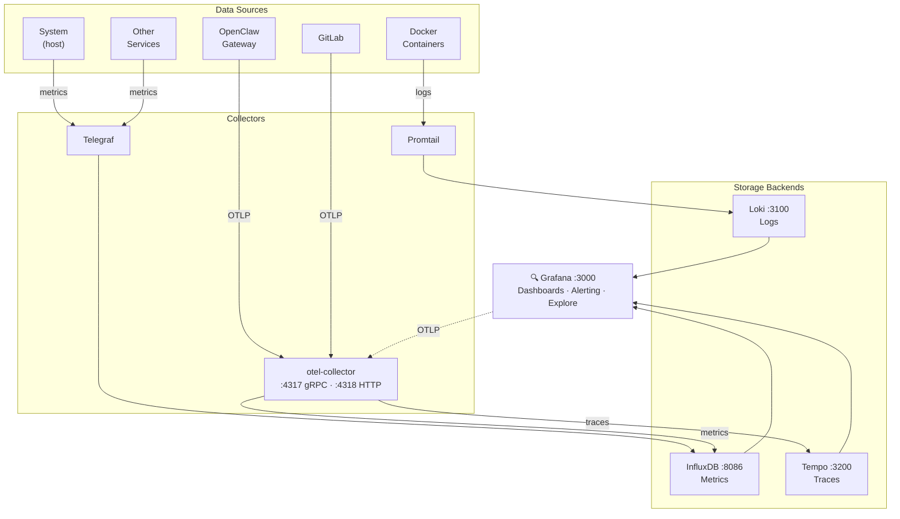

# Observability

The observability stack covers three pillars — **logs**, **metrics**, and **traces** — plus **alerting** via Grafana.

## Architecture



## Signal Routing

| Signal  | Source             | Collector         | Backend    | Query Language |
|---------|--------------------|-------------------|------------|----------------|
| Logs    | Docker containers  | Promtail          | Loki       | LogQL          |
| Metrics | System, services   | Telegraf           | InfluxDB   | Flux           |
| Metrics | OTLP-instrumented  | otel-collector     | InfluxDB   | Flux           |
| Traces  | OTLP-instrumented  | otel-collector     | Tempo      | TraceQL        |

## Components

### Logs: Promtail → Loki

**Promtail** scrapes Docker container logs via the Docker logging driver and ships them to **Loki**.

- Config: `docker/promtail/promtail-config.yaml`
- All containers use the default `json-file` log driver (Promtail reads from `/var/lib/docker/containers`)
- Loki config: `docker/loki/local-config.yaml`
- Query via Grafana Explore with LogQL

### Metrics: Telegraf → InfluxDB

**Telegraf** collects system and service metrics via plugins and writes to **InfluxDB v2**.

- Config: `docker/telegraf/telegraf.conf`
- Satellite config: `docker/telegraf/satellite-telegraf.conf`
- Org: `homelab`, Bucket: `metrics`
- ~77 input plugin instances covering Docker, system, SNMP, services, etc.
- Query via Grafana dashboards with Flux

### Traces + OTLP Metrics: otel-collector → Tempo / InfluxDB

The **OpenTelemetry Collector** (contrib distribution) receives OTLP data and routes it:

- **Traces** → Tempo (via OTLP/gRPC)
- **Metrics** → InfluxDB (via native InfluxDB exporter)
- **Logs** → debug exporter (stdout, for troubleshooting)

Config: `docker/otel-collector/config.yaml`

#### Instrumented Services

| Service   | Method                           | Signals          |
|-----------|----------------------------------|------------------|
| OpenClaw  | Native `diagnostics-otel` plugin | Traces + Metrics |
| GitLab    | Ruby OTel SDK (env vars)         | Traces           |
| Grafana   | Built-in OTel support            | Traces           |

### Alerting: Grafana

Grafana evaluates alert rules against all three backends and routes notifications.

- Alert rules: `docker/grafana/provisioning/alerting/infrastructure.yml`
- Contact points: `docker/grafana/provisioning/alerting/contactpoints.yml.j2`
- Notification policies: `docker/grafana/provisioning/alerting/policies.yml`

## Configuration Reference

| Component       | Config File                                    | Port(s)          |
|-----------------|------------------------------------------------|------------------|
| Grafana         | Env vars in `docker-compose.yml`               | 3000             |
| Loki            | `docker/loki/local-config.yaml`                | 3100             |
| Tempo           | `docker/tempo/tempo.yaml`                      | 3200, 4317, 4318 |
| InfluxDB        | Env vars in `docker-compose.yml`               | 8086             |
| Telegraf        | `docker/telegraf/telegraf.conf`                 | —                |
| Promtail        | `docker/promtail/promtail-config.yaml`         | —                |
| otel-collector  | `docker/otel-collector/config.yaml`            | 4317, 4318       |

## Adding Instrumentation

### OTLP traces (any service)

Set these environment variables in the service's compose definition:

```yaml
environment:
  - OTEL_EXPORTER_OTLP_ENDPOINT=http://otel-collector:4318
  - OTEL_EXPORTER_OTLP_PROTOCOL=http/protobuf
  - OTEL_SERVICE_NAME=your-service-name
  - OTEL_TRACES_EXPORTER=otlp
```

The service must include an OTel SDK or auto-instrumentation library. This works out of the box for:
- **Node.js** — `@opentelemetry/auto-instrumentations-node`
- **Python** — `opentelemetry-distro`
- **Ruby** — `opentelemetry-sdk` (GitLab bundles this)
- **Go** — manual SDK integration required

### OpenClaw native plugin

OpenClaw has built-in OTLP export via `diagnostics-otel`. Configured in `openclaw.json.j2`:

```json
{
  "diagnostics": {
    "enabled": true,
    "otel": {
      "enabled": true,
      "endpoint": "http://otel-collector:4318",
      "serviceName": "openclaw-gateway",
      "traces": true,
      "metrics": true
    }
  },
  "plugins": {
    "allow": ["diagnostics-otel"],
    "entries": {
      "diagnostics-otel": { "enabled": true }
    }
  }
}
```

See: https://docs.openclaw.ai/logging#export-to-opentelemetry

### Telegraf metrics (non-OTLP)

Add input plugins to `docker/telegraf/telegraf.conf`. Output is pre-configured for InfluxDB.
